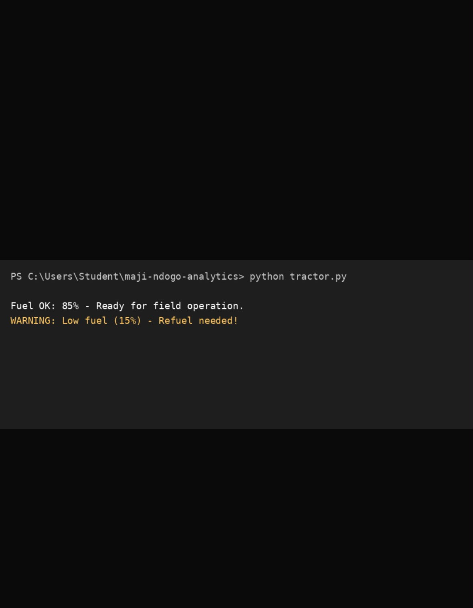
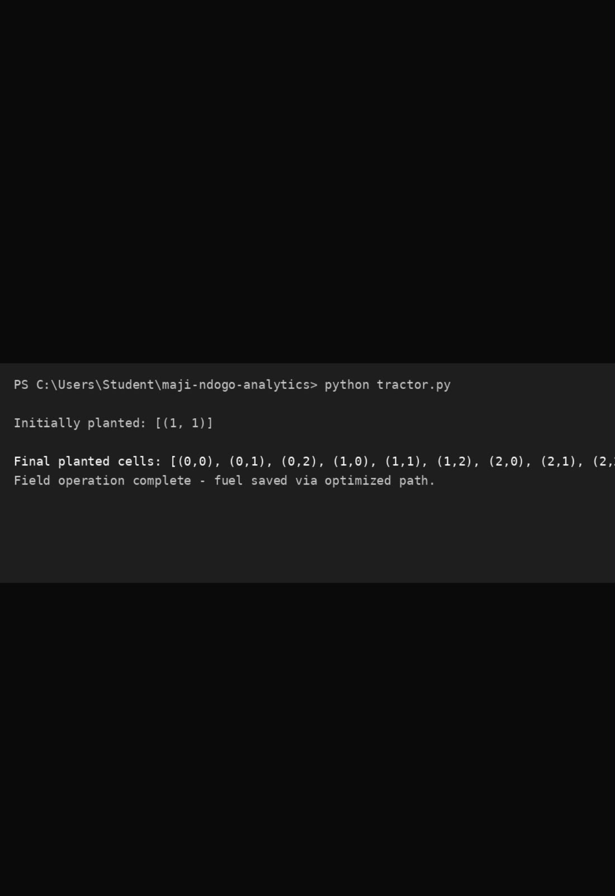

# Module 3 Case Study: Tractor Traversal Algorithm

## 1. The Business Problem
The Ministry of Agriculture required a reliable, automated path-planning algorithm for tractor field coverage. The goal was to build a modular, composable Python framework to execute efficient serpentine (zigzag) field traversals while safely handling obstacles.

## 2. The Tech Stack
- **Language:** Core Python 3
- **Concepts:** Functional Decomposition, Control Flow, List Comprehensions, Modular Design

## 3. The Deliverable

### Case Study Screenshots & Evidence

## 4. The "So What?" (Business Impact)
By replacing a monolithic script with modular functions, field operations reduce unnecessary turning maneuvers, saving fuel. This flexible pipeline allows new field conditions to be integrated without rewriting core navigation logic.
